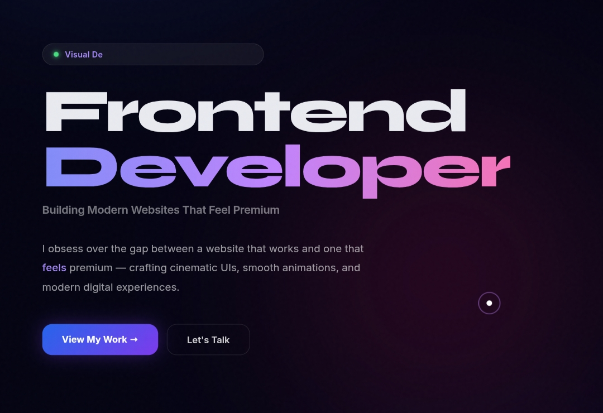
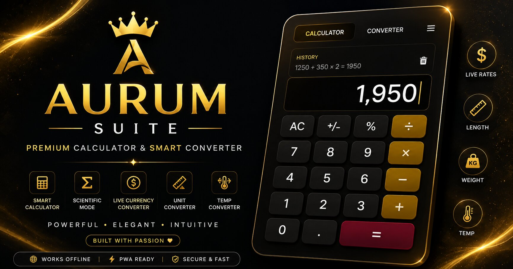

# 🚀 Ayush Raj — Frontend Developer Portfolio

A premium frontend developer portfolio showcasing modern UI design, interactive web experiences, and high-performance frontend development.

Built entirely with **HTML, CSS, and JavaScript**, this portfolio highlights my passion for creating visually polished, responsive, and immersive digital experiences.

## 🌐 Live Portfolio

🔗 https://ayushrajfrontend.github.io/ayush-portfolio/

---



# ✨ Features

- 🎨 Premium Modern UI
- 🌌 Interactive Skill Galaxy
- 🤖 AI Portfolio Assistant
- 💻 Developer Terminal
- 🚀 Smooth Animations & Micro Interactions
- 📱 Fully Responsive Design
- 🎵 Background Music Support
- 📩 Contact Form with EmailJS
- ⚡ Fast Loading Experience
- 🌙 Glassmorphism Design
- 🎯 Interactive Project Showcase

---

# 🛠 Tech Stack

### Frontend

- HTML5
- CSS3
- JavaScript (Vanilla)

### APIs & Services

- EmailJS

### Deployment

- GitHub Pages

---

# 🚀 Featured Projects

## 🌌 NebulaBeat

A futuristic galaxy-themed music visualizer built using the Web Audio API, Canvas API, WebRTC, and modern frontend technologies.


### Features

- Audio Reactive Galaxy
- Multiplayer Rooms
- WebRTC Audio Sharing
- AI Genre Detection
- Canvas Particle System
- Music Visualizer
- PWA Support

🔗 Live Demo

https://ayushrajfrontend.github.io/NebulaBeat/

🔗 Repository

https://github.com/AyushRajFrontend/NebulaBeat

---

## 🚗 ApexDrive

A cinematic futuristic hypercar showcase focused on premium UI, luxury animations, and immersive storytelling.


### Features

- Premium Landing Page
- Live Speedometer
- Interactive Car Configurator
- Engine Sound Effects
- Responsive Design
- Luxury UI Experience

🔗 Live Demo

https://ayushrajfrontend.github.io/ApexDrive/

🔗 Repository

https://github.com/AyushRajFrontend/ApexDrive

---

## ⚗️ Aurum Suite

An all-in-one premium utility web application designed with a modern interface and installable PWA experience.



### Features

- Scientific Calculator
- Unit Converter
- Currency Converter
- PWA Support
- Responsive UI
- Fast Performance

🔗 Live Demo

https://ayushrajfrontend.github.io/aurum-suite/

🔗 Repository

https://github.com/AyushRajFrontend/aurum-suite

---

# 📂 Project Structure

```
Portfolio
│
├── images
├── sounds
├── index.html
├── style.css
├── script.js
└── README.md
```

---

# 🎯 Goals

This portfolio was built to showcase my frontend development skills through real-world projects focused on:

- Premium UI Design
- Modern Frontend Development
- Performance Optimization
- Interactive User Experiences
- Responsive Design
- Creative Animations

---

# 📈 Future Updates

- More Premium Projects
- ContentCraft
- Anime Vanguard Hub
- Dark/Light Theme
- More AI Features
- Blog Section
- Project Case Studies

---

# 👨‍💻 About Me

I'm **Ayush Raj**, a passionate Frontend Developer from India focused on building premium digital experiences using modern web technologies.

I enjoy transforming ideas into interactive, responsive, and visually engaging products.

---

# 📫 Contact

📧 Email

ayushraj.frontend@gmail.com

💻 GitHub

https://github.com/AyushRajFrontend

🌐 Portfolio

https://ayushrajfrontend.github.io/ayush-portfolio/

---

# ⭐ Support

If you like this project, consider giving it a ⭐ on GitHub.

It helps support my work and motivates me to build more premium projects.
